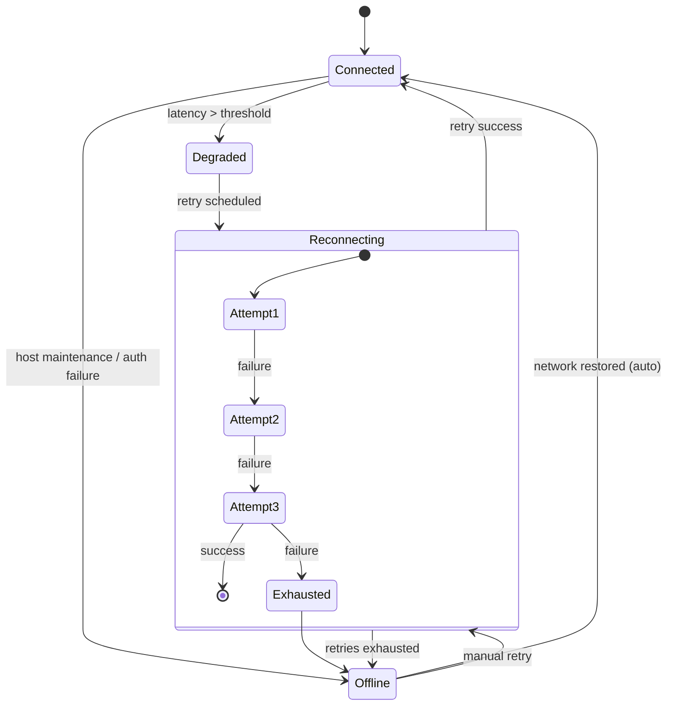

# State Model: Remote Connection Lifecycle

**Triggers**
- `latency > threshold` emitted by health monitor.
- `retry scheduled` when attempt count < 3.
- `retries exhausted` when attempt count hits maxAttempts.
- `manual retry` fired from banner CTA; resets attempt counter.

**Outputs**
- UI events: status pill update, connection banner variant, analytics events (`connection_status_changed`, `connection_retry_*`).
- Logs: health monitor writes to resilience channel with attempt details.
