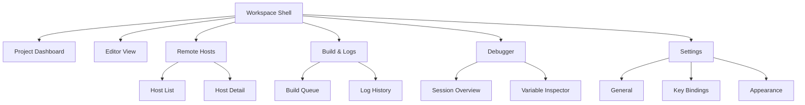
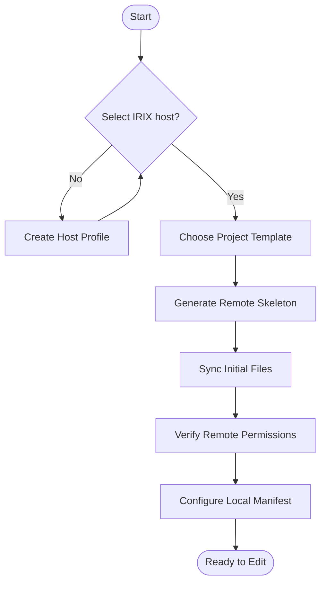
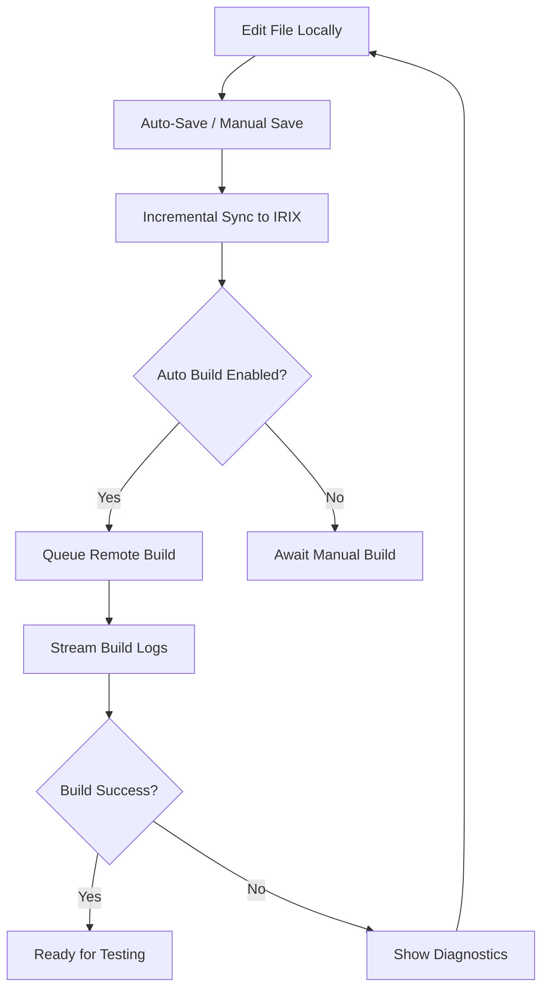
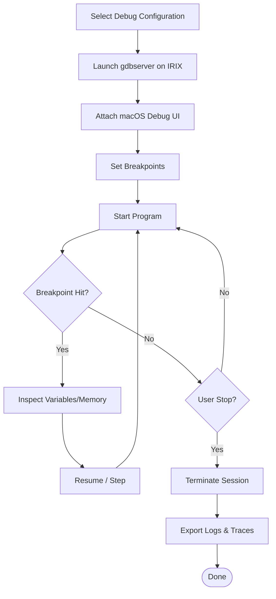

# IRIX IDE UI/UX Specification

## Introduction
This document defines the user experience goals, information architecture, user flows, and visual design specifications for the IRIX Integrated Development Environment (IDE). It serves as the foundation for visual design and frontend development, ensuring a cohesive and user-centered experience across macOS and IRIX touchpoints.

### Overall UX Goals & Principles
#### Target User Personas
- **Mac-First IDE Operator:** Wants fast iteration from macOS while targeting IRIX hosts; expects real-time feedback, low-friction host switching, and modern editor ergonomics.
- **IRIX On-Box Maintainer:** Performs maintenance directly on IRIX systems; needs Motif/Indigo Magic visual continuity, dependable terminal integration, and visibility into host state.
- **Team Lead / Reviewer (secondary):** Oversees builds/debug sessions and depends on dashboards, logs, and audit trails.

#### Usability Goals
- Onboard a new macOS IDE operator to a remote project in under **5 minutes**.
- Deliver remote build feedback within **30 seconds** of saving a file.
- Support context switching (host, project) without loss of work; recovery flows must restore sessions automatically.
- Provide consistent affordances for destructive operations (deploy, kill process) including confirmations and undo states.

#### Design Principles
1. **Remote Clarity First** – Always show connection status, active host, and sync/build state prominently.
2. **Progressive Complexity** – Start with simplified views, revealing advanced panels (plugins, perf metrics) as the user opts in.
3. **Platform Resonance** – Native macOS patterns for the desktop client; Motif/Indigo Magic when rendering on IRIX to maintain trust.
4. **Actionable Feedback** – Every remote action (sync, build, debug) returns clear outcomes with links to affected files.
5. **Resilient Workflows** – Network-aware designs that surface reconnection, retry, and offline guidance gracefully.

#### Change Log
| Date       | Version | Description                                    | Author |
|------------|---------|------------------------------------------------|--------|
| 2025-09-20 | 0.1     | Initial UI/UX specification drafted            | Sally  |

## Information Architecture (IA)
### Site Map / Screen Inventory

### Navigation Structure
**Primary Navigation:** Left rail with Workspace Shell root items (Dashboard, Editor, Remote Hosts, Build & Logs, Debugger, Settings). Collapsible to icons for power users.

**Secondary Navigation:** Contextual tabs within each area (e.g., Editor → Open Files / Search / Git; Build & Logs → Queue / History / Metrics). Breadcrumbs for multi-level areas like Remote Hosts (`Remote Hosts > octane > Processes`).

**Breadcrumb Strategy:** Display at top of content pane for nested resources (host detail, log drill-down). Breadcrumb items are interactive and keyboard navigable.

## User Flows
### Flow 1: Project Bootstrap (Mac → IRIX)

- **Edge cases:** Permission failure leads to guided troubleshooting sheet (link to knowledge base). Missing toolchain prompts suggestions (install steps, contact admin).

### Flow 2: Remote Edit & Build Loop

- **Error Handling:** Provide retry button, copy log to clipboard, jump-to-source links in diagnostics.

### Flow 3: Remote Debugging Session

- **Edge cases:** Lost connection surfaces modal with auto-retry and instructions to restart server.

## Interaction Design
### Task-Based Layouts
- **Dashboard:** Overview cards (sync status, recent builds, active hosts), quick actions, alerts.
- **Editor:** Three-pane layout (project tree, editor tabs with diff mode, context panel for docs/git). Status bar shows host, branch, sync state.
- **Remote Hosts:** Master-detail list with host health, resource usage, quick connect/disconnect controls.
- **Build & Logs:** Queue timeline, log viewer with filter/search, metrics sidebar (duration, success rate).
- **Debugger:** Toolbar (play/step), source pane with breakpoints, variable inspector, call stack, console.

### Widget Inventory
- Status Pills (sync/build state), Host cards, Collapsible panels, Log viewer (virtualized list), Terminal embed, Toast notifications, Progress bars, Toggle switches for auto build/debug options.

### Form/Command Interactions
- Host profile form with validation (SSH key path, preferred rsync binary, remote directory). Inline hints for Motif styling requirements.
- Command palette with fuzzy search for actions (connect host, trigger build, open log).

### Tables
- Host list table: columns for Host Name, Role, Status, Last Sync, Actions.
- Build history table: Build ID, Trigger Source, Duration, Result, Artifacts.
- Remote processes table: PID, Command, CPU%, Memory, Actions (kill/attach).

## Visual Design Guidelines
### Color Palette
| Usage | Value | Notes |
|-------|-------|-------|
| Primary | `#0A84FF` | macOS accent for selection and primary CTAs |
| Secondary | `#4C6EF5` | Complementary blue for secondary actions |
| Success | `#34C759` | Build success indicators |
| Warning | `#FFD60A` | Pending/at-risk states |
| Danger | `#FF3B30` | Failing builds, destructive actions |
| Background (macOS) | `#1E1E1E` | Dark default editor theme |
| Background (IRIX panels) | `#4F5B66` | Indigo Magic-inspired slate |
| Surface | `#2C2C2E` | Panels/cards |
| Text Primary | `#F2F2F7` | High contrast on dark backgrounds |
| Text Secondary | `#8E8E93` | Muted descriptive text |

### Typography
| Style | Size | Weight | Line Height |
|-------|------|--------|-------------|
| H1 | 28 px | Bold | 34 px |
| H2 | 22 px | Semibold | 28 px |
| H3 | 18 px | Medium | 24 px |
| Body | 15 px | Regular | 22 px |
| Small | 13 px | Regular | 18 px |
- Primary typeface: **SF Pro** on macOS; fallback **Helvetica Neue**. IRIX-native screens use **Helvetica** with Motif padding.

### Iconography
- **Icon Library:** SF Symbols for macOS client; custom monochrome icons styled after Indigo Magic for IRIX overlays.
- **Usage Guidelines:** Pair icons with labels in navigation; maintain 24px size with 16px padding; ensure contrast on dark backgrounds.

### Spacing & Layout
- **Grid System:** 12-column, 80px max content gutter on desktop; 16px padding on mobile.
- **Spacing Scale:** 4px base unit (4, 8, 12, 16, 24, 32, 48).

## Accessibility Requirements
- **Standard:** WCAG 2.1 AA.
- **Visual:** Contrast ratio ≥ 4.5:1, persistent focus rings, scalable text with user preference detection.
- **Interaction:** Full keyboard navigation, screen reader labels for controls/log updates, 44px minimum touch targets.
- **Content:** Alt text for host/status icons, semantic heading structure, explicit form labels and error messaging.
- **Testing Strategy:** Automated axe scans per build; manual audits with VoiceOver and keyboard-only navigation before release milestones.

## Responsiveness Strategy
### Breakpoints
| Breakpoint | Min Width | Max Width | Target Devices |
|------------|-----------|-----------|----------------|
| Mobile | 360 px | 599 px | iPhone, small Android phones |
| Tablet | 600 px | 1023 px | iPad, Surface Go |
| Desktop | 1024 px | 1439 px | Standard MacBook/desktop |
| Wide | 1440 px | - | External monitors, dual-screen setups |

### Adaptation Patterns
- **Layout Changes:** Collapsible navigation on mobile/tablet, multi-column panels on desktop/wide.
- **Navigation Changes:** Bottom tab bar on mobile; persistent left rail on desktop.
- **Content Priority:** Logs and diagnostics condense to accordions on smaller screens; primary actions float.
- **Interaction Changes:** Touch-friendly controls on mobile; hover tooltips only on desktop.

## Animation & Micro-interactions
- **Motion Principles:** Subtle, purpose-driven, easing curves that respect platform conventions (macOS standard ease-in-out, 200ms).
- **Key Animations:**
  - **Sync Status Pulse:** 300ms fade/pulse when sync completes.
  - **Build Progress Bar:** Linear fill with color transition based on state (queued → running → success/fail).
  - **Terminal Expand/Collapse:** 200ms height easing for log panels.

## Performance Considerations
- **Goals:** Initial workspace load < 2.5s on macOS; interaction response < 150ms; maintain 60 FPS for editor scrolling and animations.
- **Design Strategies:** Lazy-load heavy panels (logs, debugger); cache remote summaries; optimize diff rendering by chunking changes.

## Next Steps
### Immediate Actions
1. Review specification with product, engineering, and QA stakeholders.
2. Produce high-fidelity mockups in Figma referencing this document.
3. Begin component inventory for frontend architecture handoff.
4. Schedule usability validation with representative macOS and IRIX users.

### Design Handoff Checklist
- [x] All user flows documented
- [x] Component inventory complete
- [x] Accessibility requirements defined
- [x] Responsive strategy clear
- [x] Brand guidelines incorporated
- [x] Performance goals established

## Checklist Results
No formal UI/UX checklist executed yet; recommend running prior to high-fidelity mockups.
