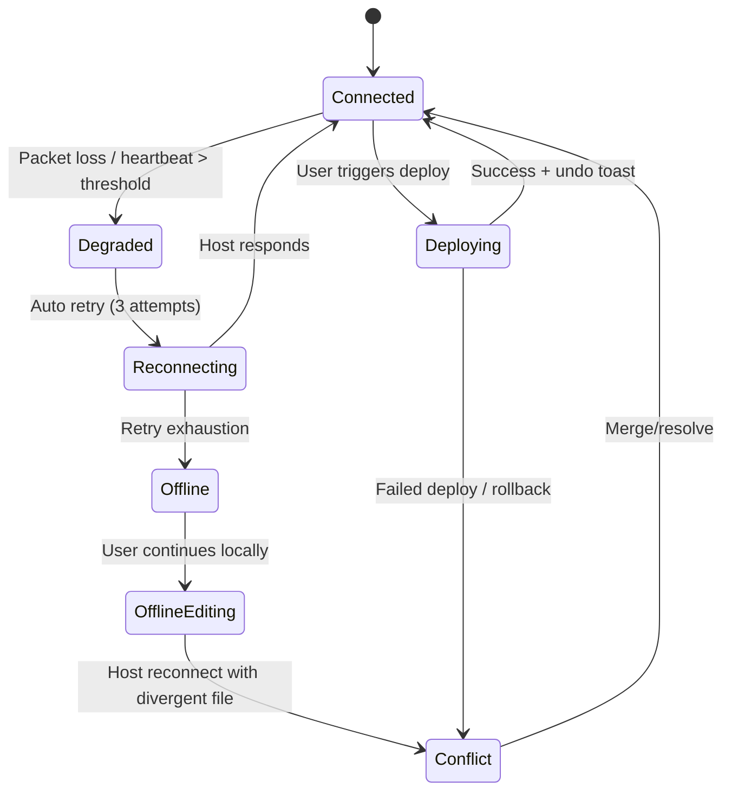
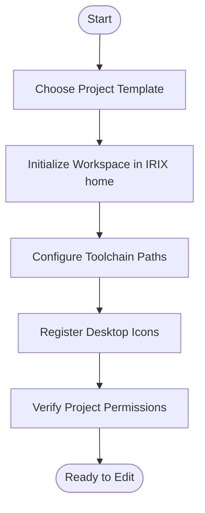

# IRIX IDE UI/UX Specification

## Introduction
This document defines the user experience goals, information architecture, user flows, and visual design specifications for the IRIX Integrated Development Environment (IDE). It serves as the foundation for visual design and frontend development within the native IRIX Motif environment.

### Overall UX Goals & Principles
#### Target User Personas
- **IRIX On-Box Maintainer:** Performs maintenance directly on IRIX systems; needs Motif/Indigo Magic visual continuity, dependable terminal integration, and visibility into host state.
- **IRIX Systems Engineer:** Balances development with operational duties, requiring dashboards for builds, telemetry, and automation tasks.
- **Team Lead / Reviewer (secondary):** Oversees builds/debug sessions and depends on dashboards, logs, and audit trails.

#### Usability Goals
- Onboard a new IRIX maintainer to the IDE in under **5 minutes** using native Toolchest integration and desktop icons.
- Deliver build and sync feedback within **30 seconds** of an edit to maintain confidence in remote workflows.
- Support context switching (host, project) without loss of work; recovery flows must restore sessions automatically across 4Dwm desks.
- Provide consistent affordances for destructive operations (deploy, kill process) including confirmations and undo states.

#### Design Principles
1. **Remote Clarity First** – Always show connection status, active host, and sync/build state prominently.
2. **Progressive Complexity** – Start with simplified views, revealing advanced panels (plugins, perf metrics) as the user opts in.
3. **Platform Resonance** – Embrace Motif/Indigo Magic idioms, pointer shapes, and spacing so the IDE feels native to IRIX.
4. **Actionable Feedback** – Every remote action (sync, build, debug) returns clear outcomes with links to affected files.
5. **Resilient Workflows** – Network-aware designs that surface reconnection, retry, and offline guidance gracefully.

#### Change Log
| Date       | Version | Description                                    | Author |
|------------|---------|------------------------------------------------|--------|
| 2025-09-22 | 0.3     | Added screen blueprints and state transitions  | James  |
| 2025-09-21 | 0.2     | Added recovery state guidance and IRIX tokens  | Sally  |
| 2025-09-20 | 0.1     | Initial UI/UX specification drafted            | Sally  |

## Information Architecture (IA)
### Site Map / Screen Inventory

### Navigation Structure
**Primary Navigation:** Left rail with Workspace Shell root items (Dashboard, Editor, Remote Hosts, Build & Logs, Debugger, Settings). Collapsible to icons for power users.

**Secondary Navigation:** Contextual tabs within each area (e.g., Editor → Open Files / Search / Git; Build & Logs → Queue / History / Metrics). Breadcrumbs for multi-level areas like Remote Hosts (`Remote Hosts > octane > Processes`).

**Breadcrumb Strategy:** Display at top of content pane for nested resources (host detail, log drill-down). Breadcrumb items are interactive and keyboard navigable.

## Screen Blueprints
### Workspace Shell & Project Explorer
- **Layout:** Left rail houses the workspace shell with project selector, quick host switcher, and collapsible project explorer tree. A tabbed secondary panel shows Git status, search, or outline depending on context.
- **States:** Connection banner anchors immediately above the editor canvas; project explorer badges reflect sync state (`Synced`, `Queued`, `Conflict`).
- **Interactions:** Command palette (for example, `Ctrl+P`) jumps between projects/recent files; context menu exposes project-level actions (sync, build, open terminal).
- **Wireframes:** `docs/user-guides/screenshots/01-editor-host-drop.svg`, `docs/user-guides/screenshots/02-editor-offline.svg` capture connected vs. offline states with explorer callouts.

### Editor & Diffing Surface
- **Layout:** Central code editor with split-pane diff toggle, diagnostics gutter, and inline task list for TODO/FIXME. Footer stack surfaces sync/build telemetry and active host pill.
- **States:** Offline mode disables destructive actions and shows unsynced badge in tab strip; diagnostics drawer auto-expands on failed build.
- **Interactions:** Inline quick-fix menu for diagnostics, jump-to-symbol palette, and keyboard shortcuts for toggling diff view.
- **Wireframes:** `docs/user-guides/screenshots/03-deploy-confirmation.svg`, `docs/user-guides/screenshots/04-sync-conflict.svg` highlight confirmation and conflict flows layered over the editor.

### Build & Logs Console
- **Layout:** Split view showing build queue table on the left and selected build log stream on the right. Metrics ribbon on top provides duration, warnings, and last success indicators.
- **States:** Streaming mode uses skeleton placeholders during reconnect; failure state pins actionable badges with links back to impacted files.
- **Interactions:** Users can pin builds, copy logs, jump to diagnostics, and filter by host/project across sessions.
- **Wireframes:** `docs/user-guides/screenshots/07-build-logs.svg` illustrates success vs. failure annotations and reconnect affordances.

### Remote Host Management
- **Layout:** Hosts list with health pill, role, and quick actions; right pane drills into selected host (process list, storage, recent commands). Secondary tabs expose credentials and automation hooks.
- **States:** Health colors map to connection telemetry (`Connected`, `Degraded`, `Offline`). Pending retries surface timer and cancel controls.
- **Interactions:** Inline onboarding for new hosts, mass actions for start/stop services, and activity feed summarizing recent sync/deploy events.
- **Wireframes:** `docs/user-guides/screenshots/05-remote-hosts.svg` and `docs/user-guides/screenshots/06-dashboard-overview.svg` cover overview and deep-dive modes.

### Settings & Operational Panels
- **Layout:** Sidebar with preference categories (Profile, Key Bindings, Appearance, Notifications). Detail pane exposes form fields with inline validation and preview toggles for theme adjustments.
- **States:** Panels share structure across IDE modules and adopt Motif tokens and padding. Advanced settings gated behind disclosure to reduce noise.
- **Interactions:** Live preview for theme changes, import/export workspace profile, and warning banners for unsafe configurations.
- **Wireframes:** `docs/user-guides/screenshots/09-settings.svg` frames category navigation and validation treatments.

## State Transitions & Remote Resilience

- **Navigation Hooks:** Status pill drives quick navigation to Remote Hosts during `Degraded`/`Offline` states; command palette surfaces retry/queue actions.
- **Activity Logging:** Each transition posts to the activity feed (Dashboard) to preserve audit trail for downstream analytics.
- **Accessibility Notes:** Banner text and state colors pass contrast requirements; all transitions announce via Motif accessibility hooks (audible bell + status strip message).

## User Flows
### Flow 1: Project Bootstrap (IRIX Workspace)

- **Edge cases:** Permission failure leads to guided troubleshooting sheet (link to knowledge base). Missing toolchain prompts install steps or escalation to system administration.

### Flow 2: Remote Edit & Build Loop

- **Error Handling:** Provide retry button, copy log to clipboard, jump-to-source links in diagnostics.

### Flow 3: Remote Debugging Session

- **Edge cases:** Lost connection surfaces modal with auto-retry and instructions to restart server.

## Interaction Design
### Task-Based Layouts
- **Dashboard:** Overview cards (sync status, recent builds, active hosts), quick actions, alerts.
- **Editor:** Three-pane layout (project tree, editor tabs with diff mode, context panel for docs/git). Status bar shows host, branch, sync state.
- **Remote Hosts:** Master-detail list with host health, resource usage, quick connect/disconnect controls.
- **Build & Logs:** Queue timeline, log viewer with filter/search, metrics sidebar (duration, success rate).
- **Debugger:** Toolbar (play/step), source pane with breakpoints, variable inspector, call stack, console.

### Widget Inventory
- Status Pills (sync/build state), Host cards, Collapsible panels, Log viewer (virtualized list), Terminal embed, Toast notifications, Progress bars, Toggle switches for auto build/debug options.
- Destructive action confirmation sheet (two-step modal with summary of impact, secondary "Cancel" default, optional checkbox to suppress for session).
- Undo toast with countdown (5s default) for recoverable destructive actions (deploy, kill process) and inline "View Details" link.
- Offline banner pattern with iconography matching status pills, contextual actions (`Retry`, `Work Offline`, `Switch Host`).

### State Handling & Recovery
- **Connection States:** Status pill variants for `Connected`, `Degraded`, `Reconnecting`, `Offline`; degraded/offline states pin to the global header and mirror in the status bar.
- **Host Drop:** Inline banner appears in active workspace with summary (`Lost connection to octane`), primary action `Retry`, secondary `Switch Host`, tertiary link to troubleshooting sheet.
- **Retry Policy:** Automatic retry attempts 3x with exponential backoff; each attempt updates banner copy (`Retrying… (2 of 3)`), and success collapses banner with a "Resolved" toast.
- **Offline Editing:** Editor enters pending mode with file tabs showing unsynced badge, command palette surfaces `Queue Sync` action; Build/Deploy buttons disable with tooltip `Unavailable offline`.
- **Sync Conflicts:** Modal summarizes conflicting files, provides diff preview, and lets user choose `Keep Local`, `Keep Remote`, or `Open Merge Tool`.
- **Diagnostics Continuity:** When log streaming pauses, show skeleton loader plus `Reconnect Logs` action; if reconnection fails, convert to persistent banner in Build & Logs view.

### Form/Command Interactions
- Host profile form with validation (SSH key path, preferred rsync binary, remote directory). Inline hints for Motif styling requirements.
- Command palette with fuzzy search for actions (connect host, trigger build, open log).

### Tables
- Host list table: columns for Host Name, Role, Status, Last Sync, Actions.
- Build history table: Build ID, Trigger Source, Duration, Result, Artifacts.
- Remote processes table: PID, Command, CPU%, Memory, Actions (kill/attach).

## Visual Design Guidelines
### Color Palette
| Usage | Value | Notes |
|-------|-------|-------|
| Primary | `#6699CC` | Indigo Magic accent for primary actions |
| Secondary | `#5E6B7A` | Panel chrome and secondary controls |
| Success | `#94D55A` | Build success indicators |
| Warning | `#FFD454` | Pending/at-risk states |
| Danger | `#FF6B6B` | Failing builds, destructive actions |
| Background | `#4F5B66` | Motif desktop base |
| Surface | `#3B4654` | Dialogs, cards, and explorers |
| Text Primary | `#F2F2F7` | High contrast on dark backgrounds |
| Text Secondary | `#D0D8E2` | Muted descriptive text |

#### IRIX UI Tokens
- **Accent:** `#6699CC` (Indigo Magic blue) applied to primary buttons, focus outlines, and active tabs when rendering natively on IRIX.
- **Window Chrome:** `#1F2A38` header bars with `#95C8D8` divider lines to match Motif-era depth cues.
- **Control Density:** Default padding 6px vertical / 12px horizontal, checkbox/radio set to 18px with square corners, and button corner radius locked at 2px.
- **Shadow Treatment:** 1px inset `#0F141D` plus 2px outer `rgba(17, 26, 38, 0.35)` to mimic IRIX widget embossing.
- **Disabled State:** `#7F8A99` text/icons on `#4F5B66` surfaces with 60% opacity overlays to preserve contrast.

### Typography
| Style | Size | Weight | Line Height |
|-------|------|--------|-------------|
| H1 | 28 px | Bold | 34 px |
| H2 | 22 px | Semibold | 28 px |
| H3 | 18 px | Medium | 24 px |
| Body | 15 px | Regular | 22 px |
| Small | 13 px | Regular | 18 px |
- Primary typeface: **Helvetica** family, matching IRIX Motif defaults; monospaced elements use **Courier**.

### Iconography
- **Icon Library:** Monochrome Indigo Magic icon set with magic-carpet executable treatment per IRIX UI guidelines.
- **Usage Guidelines:** Pair icons with labels in navigation; maintain 24px size with 16px padding; ensure contrast on dark backgrounds.

### Spacing & Layout
- **Grid System:** 12-column, 80px max content gutter on desktop; 16px padding on mobile.
- **Spacing Scale:** 4px base unit (4, 8, 12, 16, 24, 32, 48).

## Accessibility Requirements
- **Standard:** WCAG 2.1 AA.
- **Visual:** Contrast ratio ≥ 4.5:1, persistent focus rings, scalable text with user preference detection.
- **Interaction:** Full keyboard navigation, screen reader labels for controls/log updates, 44px minimum touch targets.
- **Content:** Alt text for host/status icons, semantic heading structure, explicit form labels and error messaging.
- **Testing Strategy:** Automated axe scans per build; manual audits with VoiceOver and keyboard-only navigation before release milestones.

## Responsiveness Strategy
### Desktop Adaptation
- **Display Targets:** IRIX workstations running 4Dwm with resolutions ≥1280×1024; ensure usability down to 1024×768 for legacy displays.
- **Window Management:** Support resizable panes; when space constrained, collapse secondary panels into Motif drawers while preserving keyboard access.
- **Density Modes:** Default spacing follows Motif 6px/12px rules with optional high-density mode for power users.
- **Navigation Behavior:** Persistent left rail with collapse-to-icon at ≤1366px; avoid bottom tab patterns inconsistent with 4Dwm.
- **Content Priority:** Logs and diagnostics use progressive disclosure drawers rather than responsive accordions.
- **Interaction Considerations:** Hover/keyboard affordances only; touch gestures out of scope. Ensure pointer themes follow IRIX guidelines.

## Animation & Micro-interactions
- **Motion Principles:** Subtle, purpose-driven easing aligned with IRIX animation guidance (200ms ease-in-out for banners/toasts).
- **Key Animations:**
  - **Sync Status Pulse:** 300ms fade/pulse when sync completes.
  - **Build Progress Bar:** Linear fill with color transition based on state (queued → running → success/fail).
  - **Terminal Expand/Collapse:** 200ms height easing for log panels.

## Performance Considerations
- **Goals:** Initial workspace load < 2.5s on IRIX workstations; interaction response < 150ms; maintain 60 FPS for editor scrolling and animations where hardware permits.
- **Design Strategies:** Lazy-load heavy panels (logs, debugger); cache remote summaries; optimize diff rendering by chunking changes.

## Next Steps
### Immediate Actions
1. Review specification with product, engineering, and QA stakeholders.
2. Produce repository-managed high-fidelity mockups per `projects/irix-ide/docs/hifi-mockup-plan.md`, storing sources/exports under `projects/irix-ide/docs/user-guides/mockups/`.
3. Maintain the canonical component library using `projects/irix-ide/docs/front-end-component-inventory.md` while preparing design system handoff.
4. Schedule usability validation with representative IRIX operators and QA analysts.

### Design Handoff Checklist
- [x] All user flows documented
- [x] Component inventory complete
- [x] Accessibility requirements defined
- [x] Responsive strategy clear
- [x] Brand guidelines incorporated
- [x] Performance goals established

## Checklist Results
No formal UI/UX checklist executed yet; recommend running prior to high-fidelity mockups.
